# zlink 

zlink 是一个基于 flink 开发的分布式数据开发工具，提供简单的易用的操作界面，降低用户学习 flink 的成本，缩短任务配置时间，避免配置过程中出现错误。用户可以通过拖拉拽的方式实现数据的实时同步，支持多数据源之间的数据同步。同时一键部署，支持查看日志，任务报警，任务重启等功能。

## 使用场景

- 提供可视化界面，实现实时数据的快速编排
- 任务报警
- 元数据监控
- 解决复杂数据的同步问题
- 以 flink 为基础，获得数据一致性保障

## 技术概述

## 特征

- 支持FlinkCDC全库实时入库入湖，多库输出，自动建表。
- 通过 web 拖拉拽的方式构建实时同步任务，减轻了大量字段校验等繁杂工作
- 支持 flinksql 开发，自动提示补全、语法高亮、语句美化、在线调试
- 支持FlinkSQL多开发执行模式：Local, Standalone, Yarn Per-Job, Kubernetes Application.
- 支持自动管理的 SavePoint/CheckPoint 恢复和触发机制：最新、最早、指定等。
- flink 任务运行记录展示，可以在页面操作停止任务
- 支持修改任务状态，启动/停止，即时生效
- 支持实时工作告警和告警群：钉钉、微信、飞书、邮箱等。
- 支持 SPI 插件

## 登录界面

访问 `http:ip:5465` 地址，进入登录界面

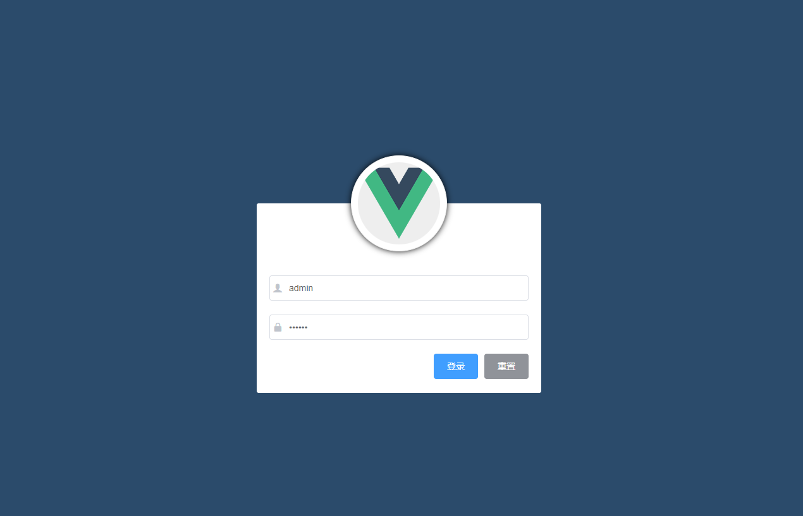

## 数据源配置中心

可以进行创建，修改，删除数据源，并且可以识别出ip是否为内网

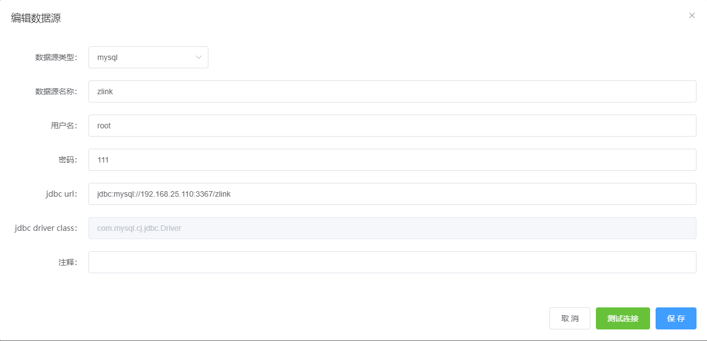

此处为编辑数据源，默认在保存前会进行一次测试连接，如果测试不通过，则不保存。

## flink 配置中心

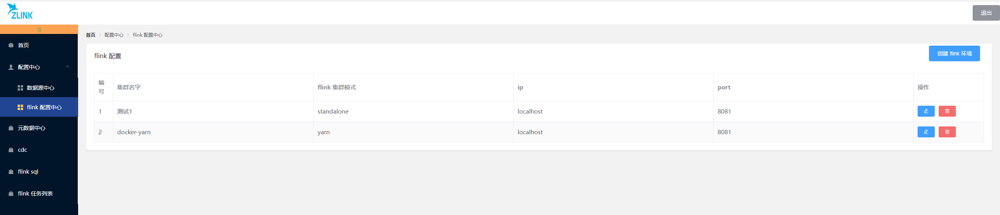

flink 配置展示界面

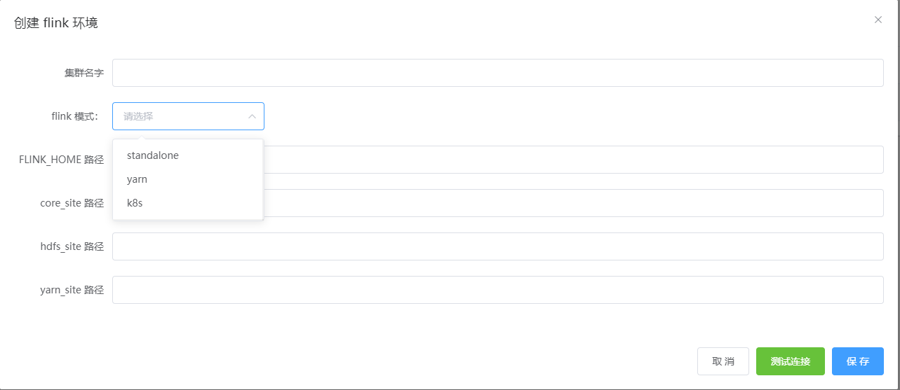

创建 flink 环境界面，flink 模式有 3 中，已支持 standalone 以及 yarn，目前 k8s 正在开发中。如果是 yarn 模式需要填写 FLINK_HOME、core_site、hdfs_site、yarn_site 路径。

例如下图：

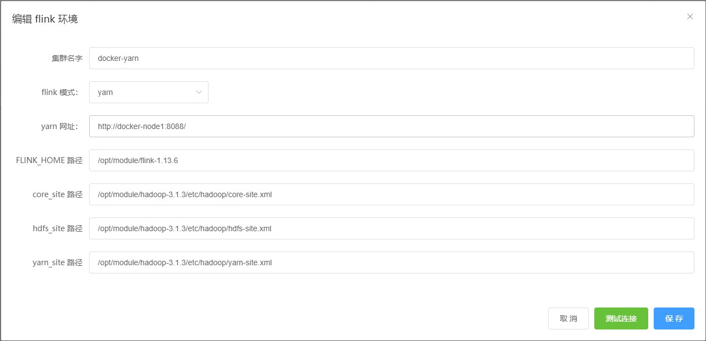

## 元数据中心

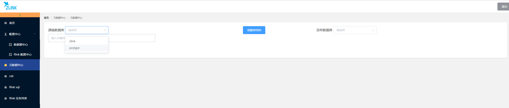

此处的`源端数据库`和`目标数据库`是在`数据源中心`配置的

### 同步表结构

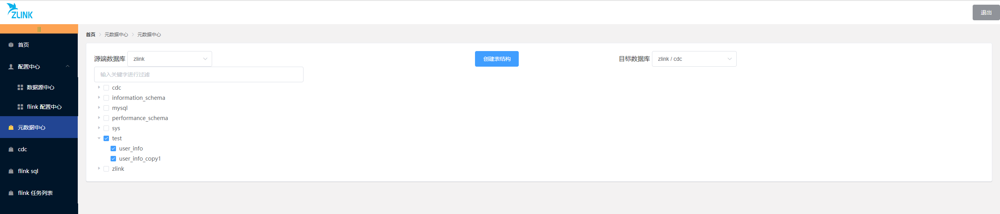

在`源端数据库` 数据库中勾选上要同步的表结构，同时在 `目标数据库` 上勾选上将要同步到的数据库，点击`创建表结构`按钮，将会按照下面表结构的前后缀自动创建表（可以不填）。

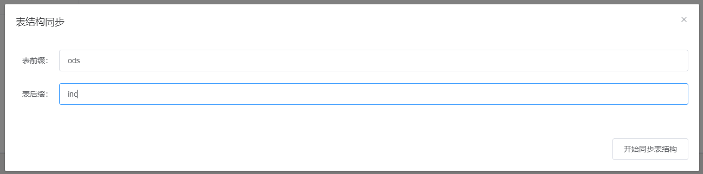

## cdc 实时同步数据

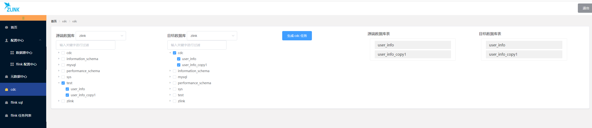

在 `源端数据库` 和 `目标数据库` 选中要同步的表结构，将会在右侧生成表名。注意：如果是多个表，要保证`源端数据库表` 和`目标数据库表` 顺序一致，若顺序不一致可以拖动

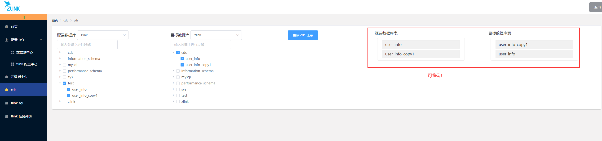

然后点击 `生成cdc任务按钮` 就可以生成 flink 任务

## flink 任务列表

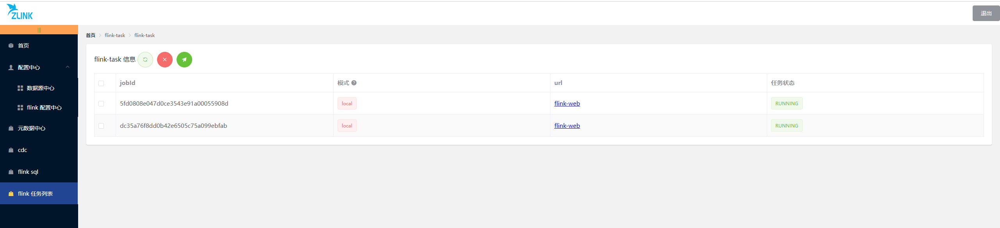

此时生成的列表就是刚刚生成的同步表结构任务，每个任务都可以单独操作，也可以批量操作。点击 url 连接就会跳转到对应的 flink-web 界面。

### 推送

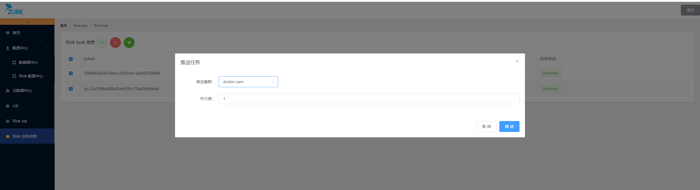

点击飞机按钮就可以选择集群（在flink 配置中心设置的）推送到指定的集群上，此时就可以在 yarn 管理界面上查看任务。

## flink-sql

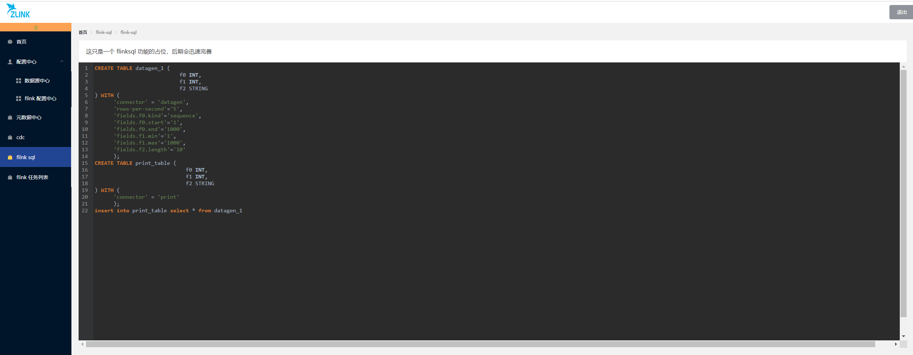

未来这里会添加 flink-sql 功能，避免在代码中写死 sql。同时可以添加调试功能，一键推送到指定集群上运行。