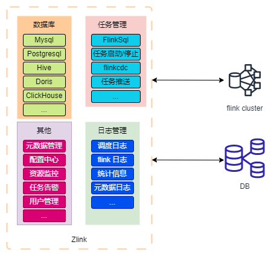

zlink 是一个基于 flink 开发的分布式数据开发工具，提供简单的易用的操作界面，降低用户学习 flink 的成本，缩短任务配置时间，避免配置过程中出现错误。用户可以通过拖拉拽的方式实现数据的实时同步，支持多数据源之间的数据同步。同时一键部署，支持查看日志，任务报警，任务重启等功能。

## 使用场景
- 提供可视化界面，实现实时数据的快速编排
- 任务报警
- 元数据监控
- 解决复杂数据的同步问题
- 以 flink 为基础，获得数据一致性保障

## 技术概述

## 特征

- 支持FlinkCDC全库实时入库入湖，多库输出，自动建表。
- 通过 web 拖拉拽的方式构建实时同步任务，减轻了大量字段校验等繁杂工作
- 支持 flinksql 开发，自动提示补全、语法高亮、语句美化、在线调试
- 支持FlinkSQL多开发执行模式：Local, Standalone, Yarn Per-Job, Kubernetes Application.
- 支持自动管理的 SavePoint/CheckPoint 恢复和触发机制：最新、最早、指定等。
- flink 任务运行记录展示，可以在页面操作停止任务
- 支持修改任务状态，启动/停止，即时生效
- 支持实时工作告警和告警群：钉钉、微信、飞书、邮箱等。
- 支持 SPI 插件
